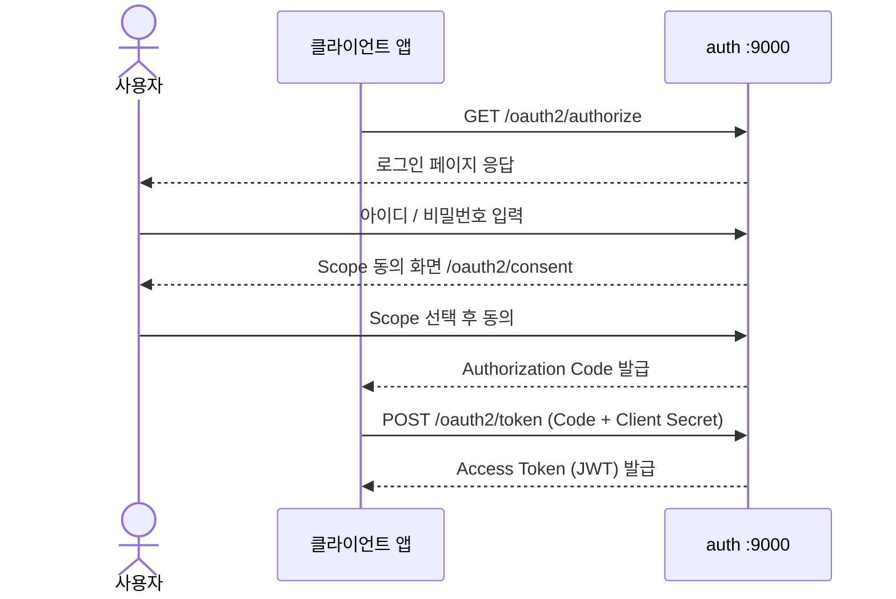
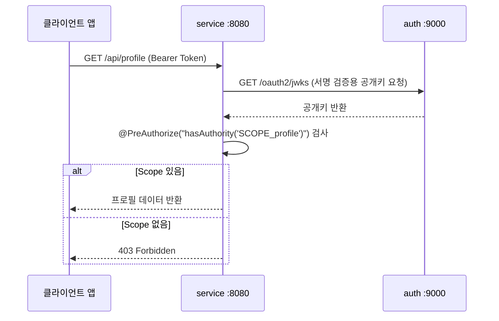

# FISA-OAuth

클라이언트 애플리케이션 예시: [fisa-oauth-next-service](https://github.com/sene03/fisa-oauth-next-service)

<br>

## 목차

- [프로젝트 구성](#프로젝트-구성)
- [처리 흐름](#처리-흐름)
- [핵심 구현](#핵심-구현)
  - [클라이언트 등록과 Scope 관리](#1-클라이언트-등록과-scope-관리)
  - [JWT 커스터마이징](#2-jwt-커스터마이징)
  - [사용자 동기화](#3-사용자-동기화)
- [프로젝트 구조](#프로젝트-구조)

<br>

## 프로젝트 구성

| 모듈 | 기술 | 포트 | 역할 |
|------|------|:----:|------|
| `auth` | Spring Boot 4 / Spring Authorization Server | 9000 | OAuth2 인가 서버. 클라이언트 인가 요청 처리, 사용자 인증, JWT 발급, Scope 동의 |
| `service` | Spring Boot 4 / Spring Resource Server | 8080 | OAuth2 리소스 서버. JWT 검증 및 Scope 기반 API 접근 제어 |

<br>

## 처리 흐름

### 로그인 — 인가 요청 처리

클라이언트가 `/oauth2/authorize`로 인가 요청을 보내면, auth 서버는 사용자 로그인과 Scope 동의를 처리한 뒤 Authorization Code를 발급한다.
이후 클라이언트가 Code를 가져오면 `/oauth2/token`에서 Access Token(JWT)으로 교환해준다.



### 회원 정보 조회 — Scope 기반 접근 제어

클라이언트가 Access Token을 Bearer로 붙여 service 서버 API를 호출하면, service 서버는 auth 서버의 JWKS로 토큰을 검증하고 Scope를 확인한다.



<br>

## 핵심 구현

### 1. 클라이언트 등록과 Scope 관리

**① auth 서버 — 클라이언트 등록 시 허용 Scope 및 인증 방식 정의**

```java
// auth/config/ServerConfig.java
RegisteredClient registeredClient = RegisteredClient.withId(UUID.randomUUID().toString())
        .clientId("test-client")
        .clientSecret(passwordEncoder().encode("your-secret"))
        .clientAuthenticationMethods(methods -> {
            methods.add(ClientAuthenticationMethod.CLIENT_SECRET_BASIC); // Authorization 헤더 방식
            methods.add(ClientAuthenticationMethod.CLIENT_SECRET_POST);  // Body 방식
        })
        .authorizationGrantTypes(types -> {
            types.add(AuthorizationGrantType.AUTHORIZATION_CODE); // 인가 코드 방식
            types.add(AuthorizationGrantType.REFRESH_TOKEN);      // 리프레시 토큰 허용
        })
        .redirectUri("http://localhost:3000/api/auth/callback/fisa") // callback 경로
        .scopes(scope -> {                 // 요청받을 Scope 설정
            scope.add(OidcScopes.OPENID);  // OpenID Connect 필수 scope
            scope.add(OidcScopes.PROFILE); // 프로필 정보 접근
            scope.add("email");            // 이메일 접근
        })
        .clientSettings(ClientSettings.builder()
                .requireAuthorizationConsent(true) // 매 요청마다 사용자 동의 화면 표시
                .build())
        .build();
```

**② auth 서버 — 사용자 동의 화면에서 Scope 선택**

```java
// auth/authentication/controller/ConsentController.java
@GetMapping("/oauth2/consent")
public String consent(
        @RequestParam("client_id") String clientId,
        @RequestParam("scope") String scope,
        @RequestParam("state") String state,
        Model model) {
    Set<String> scopeSet = new HashSet<>(Arrays.asList(scope.split(" "))); // Scope를 분리하여 Set에 저장
    model.addAttribute("scopes", scopeSet);
    return "consent";
}
```

사용자가 동의 화면에서 체크박스로 허용할 Scope를 직접 선택한다.
선택된 Scope만 JWT의 `scope` 클레임에 포함된다.

**③ service 서버 — `@PreAuthorize`로 API별 Scope 검사**

```java
// service/controller/ApiController.java
@GetMapping("/profile")
@PreAuthorize("hasAuthority('SCOPE_profile')")
public Map<String, Object> getProfile(@AuthenticationPrincipal Jwt jwt) { ... }

@GetMapping("/posts")
@PreAuthorize("hasAuthority('SCOPE_read:posts')")
public Map<String, Object> getPosts() { ... }
```

Spring Security는 JWT의 `scope` 클레임에 `SCOPE_` 접두사를 붙여 권한으로 등록한다.
`@PreAuthorize`가 해당 권한 보유 여부를 검사하여 없으면 403을 반환한다.

---

### 2. JWT 커스터마이징

Access Token 발급 시 JWT Payload를 커스터마이징한다.

```java
// auth/config/JwtCustomizerConfig.java
context.getClaims()
    .subject(user.getId())                  // sub: Auth DB의 사용자 UUID
    .claim("username", user.getUsername())  // 표시용 사용자명
    .claim("email", user.getEmail());       // 이메일
```

`sub`에 username 대신 UUID를 사용하는 이유는 auth 서버와 service 서버의 DB가 분리되어 있기 때문이다.
service 서버는 `jwt.getSubject()`로 UUID를 얻어 자신의 DB에서 사용자를 식별한다.

---

### 3. 사용자 동기화

service 서버는 별도의 DB를 가지며, auth 서버의 사용자 UUID를 기준으로 사용자를 관리한다.
클라이언트가 `/api/profile`을 호출하면 아래 동기화 로직이 실행된다.

```java
// service/domain/user/service/UserService.java
public User syncUserFromAuthServer(String authServerUserId, String email, String nickname) {
    return userRepository.findByAuthServerUserId(authServerUserId)
            .map(existingUser -> {
                existingUser.updateProfile(email, nickname);
                return existingUser;
            })
            .orElseGet(() -> {
                User newUser = User.builder()
                        .authServerUserId(authServerUserId)
                        .email(email)
                        .nickname(nickname)
                        .build();
                return userRepository.save(newUser);
            });
}
```

auth 서버 UUID를 기준으로 service DB에 사용자가 없으면 생성하고, 있으면 프로필을 업데이트한다.

<br>

## 프로젝트 구조

```
fisa-oauth/
├── auth/                               # OAuth2 인가 서버 (포트 9000)
│   └── src/main/java/com/fisa/auth/
│       ├── config/                     # SecurityConfig, ServerConfig, JwtCustomizerConfig
│       ├── authentication/             # 사용자 인증, 회원가입, Scope 동의
│       └── dashboard/                  # 개발자 콘솔, 클라이언트 앱 관리
└── service/                            # OAuth2 리소스 서버 (포트 8080)
    └── src/main/java/com/fisa/service/
        ├── config/                     # ResourceServerConfig
        ├── controller/                 # Scope 기반 API 엔드포인트
        ├── domain/                     # User, Post 엔티티
        └── exception/                  # CustomExceptionHandler
```
