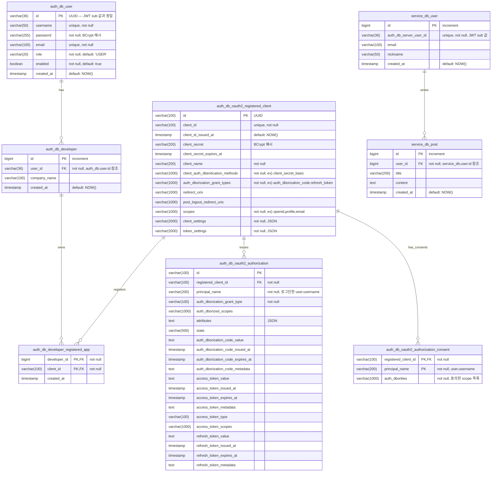
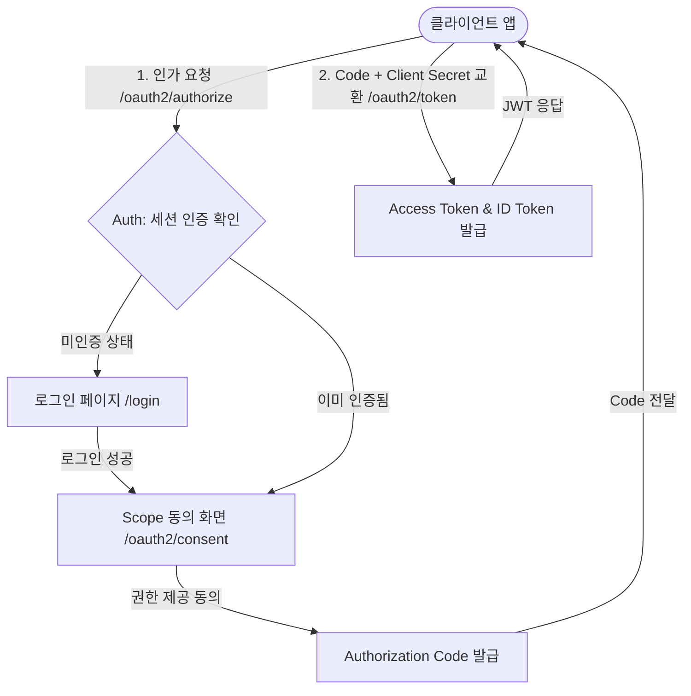
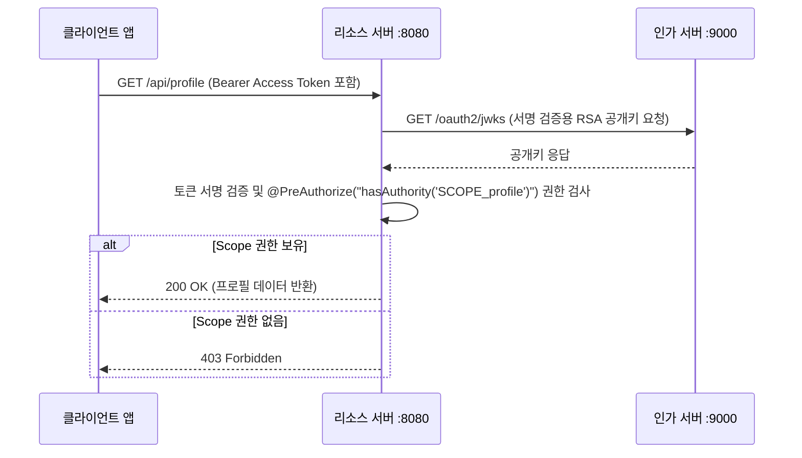
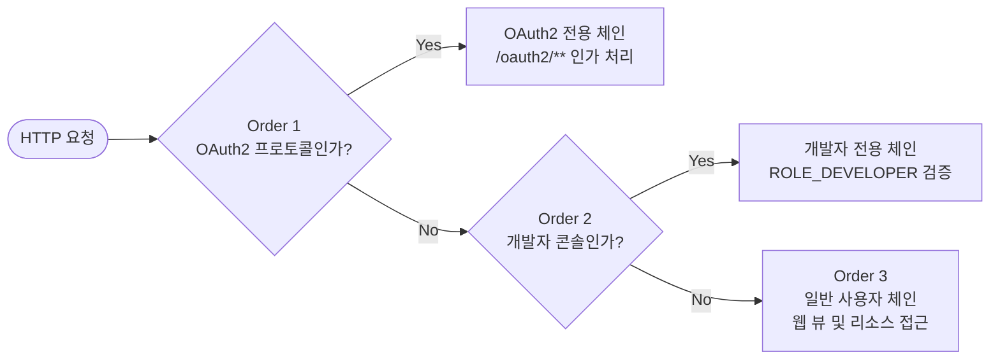

# 🔐 FISA-OAuth (Spring 기반 OAuth2 인증/인가 시스템)

> **OAuth 2.0 이란?**
> 클라이언트 애플리케이션이 사용자(리소스 소유자)의 자격 증명(비밀번호 등)을 직접 다루지 않고, 인가 서버를 통해 안전하게 리소스에 접근할 수 있도록 권한을 위임하는 업계 표준 프로토콜입니다.
> 출처: Spring OAuth2 문서

**Spring Authorization Server**를 활용하여 자체적인 **인가 서버(Auth Server)**와 **리소스 서버(Resource Server)**를 분리하여 구축하고, JWT 기반의 인증을 구현한다.

🔗 **참고 링크**
- [클라이언트 애플리케이션 예시 (Next.js)](https://github.com/sene03/fisa-oauth-next-service)
- [Spring OAuth2 공식 문서](https://docs.spring.io/spring-security/reference/reactive/oauth2/index.html)


## 클라이어트 어플리케이션 예시
예시 클라이언트 어플리케이션에서 Fisa-OAuth 서비스 이용 화면


### 로그인 요청 응답 화면


### 회원가입 이후 consent 화면


### 동의 버튼 클릭 이후


---

## 📑 목차

- [프로젝트 구성 및 아키텍처](#️-프로젝트-구성-및-아키텍처)
- [데이터베이스 설계 (ERD)](#️-데이터베이스-설계-erd)
- [핵심 인증 흐름 (Auth Flow)](#-핵심-인증-흐름-auth-flow)
- [주요 구현 상세 (Core Logic)](#-주요-구현-상세-core-logic)
  - [1. 클라이언트 등록 및 Scope 제어](#1-클라이언트-등록-및-scope-제어)
  - [2. JWT Payload 커스터마이징](#2-jwt-payload-커스터마이징)
  - [3. 분산 환경에서의 사용자 동기화](#3-분산-환경에서의-사용자-동기화)
- [Security 필터 체인 설계](#-security-필터-체인-설계)
- [사용자 경험(UX) 개선](#-사용자-경험ux-개선)

---

## ⚙️ 프로젝트 구성 및 아키텍처

역할과 책임을 명확히 분리하기 위해 서버를 2개의 독립된 모듈로 구성했습니다.

| 모듈 | 기술 스택 | 포트 | 역할 및 특징 | 
| ----- | ----- | :---: | ----- | 
| `auth` | Spring Boot<br>Spring Authorization Server | **9000** | **OAuth2 인가 서버 (Auth Server)**<br>클라이언트 인가 요청 처리, 사용자 인증, JWT(Access/ID Token) 발급 및 서명, 권한 동의 화면 제공 | 
| `service` | Spring Boot<br>Spring Resource Server | **8080** | **OAuth2 리소스 서버 (Resource Server)**<br>발급된 JWT의 서명 검증, Scope 기반의 안전한 API 엔드포인트 접근 제어 | 

### 📂 디렉토리 구조

```text
fisa-oauth/
├── auth/                               # OAuth2 인가 서버 (포트 9000)
│   └── src/main/java/com/fisa/auth/
│       ├── config/                     # Security 설정, JWT 커스터마이징, 인가 서버 설정
│       ├── authentication/             # 사용자 인증(Login), 회원가입, 권한 동의(Consent) 처리
│       └── dashboard/                  # 개발자 전용 콘솔, 클라이언트 앱 등록/관리
│
└── service/                            # OAuth2 리소스 서버 (포트 8080)
    └── src/main/java/com/fisa/service/
        ├── config/                     # Resource Server 보안 설정
        ├── controller/                 # Scope 기반 비즈니스 API 엔드포인트
        ├── domain/                     # User, Post 등 핵심 도메인 엔티티
        └── exception/                  # 전역 예외 처리 (CustomExceptionHandler)
```

---

## 🗄️ 데이터베이스 설계 (ERD)

Spring Authorization Server의 표준 스키마를 기반으로, 비즈니스 요구사항(개발자, 게시글 등)을 반영하여 설계


<br>
<details>
<summary><h3>
  🛠️ 초기 데이터베이스 및 저장소 세팅 (클릭하여 펼치기)
</h3></summary>
<div markdown="1">

#### 클라이언트 영속성 관리 (RegisteredClientRepository)
테스트 단순화를 위해 `InMemoryRegisteredClientRepository`를 사용하여 빠르게 테스트 환경을 구축했으며,
프로덕션 환경에서는 `JdbcRegisteredClientRepository`를 통해 클라이언트 정보를 저장할 수 있도록 설계

**[운영 환경 JDBC 설정 로직]**
```java
@Bean
public RegisteredClientRepository registeredClientRepository(JdbcTemplate jdbcTemplate) {
    JdbcRegisteredClientRepository repository = new JdbcRegisteredClientRepository(jdbcTemplate);
    
    // 1. 개발자 콘솔 테스트용 클라이언트 초기화
    if (repository.findByClientId("your-client") == null) {
        RegisteredClient developerClient = RegisteredClient.withId(UUID.randomUUID().toString())
            .clientId("your-client")
            // ... (설정 생략) ...
            .build();
        repository.save(developerClient);
    }

    // 2. 외부 서비스 연동용(Next.js) 클라이언트 초기화
    if (repository.findByClientId("test-client") == null) {
        RegisteredClient registeredClient = RegisteredClient.withId(UUID.randomUUID().toString())
            .clientId("test-client")
            // ... (설정 생략) ...
            .build();
        repository.save(registeredClient);
    }

    return repository;
}
```

#### DDL 및 프로퍼티 설정

**Auth (application.properties)**
```properties
spring.jpa.hibernate.ddl-auto=create
spring.jpa.open-in-view=false
spring.jpa.show-sql=true
spring.jpa.properties.hibernate.format_sql=true
spring.jpa.properties.hibernate.jdbc.time_zone=Asia/Seoul
```

**Service (application.properties)**
```properties
spring.jpa.hibernate.ddl-auto=update
spring.jpa.show-sql=true
spring.jpa.properties.hibernate.format_sql=true
spring.jpa.database-platform=org.hibernate.dialect.MySQLDialect
```

**표준 OAuth2 DDL 쿼리 (MySQL)**
```sql 
drop table if exists oauth2_authorization_consent, oauth2_authorization, oauth2_registered_client;

CREATE TABLE if not exists oauth2_authorization_consent (
    registered_client_id varchar(100) NOT NULL,
    principal_name varchar(200) NOT NULL,
    authorities varchar(1000) NOT NULL,
    PRIMARY KEY (registered_client_id, principal_name)
);

CREATE TABLE if not exists oauth2_authorization (
    id varchar(100) NOT NULL,
    registered_client_id varchar(100) NOT NULL,
    principal_name varchar(200) NOT NULL,
    authorization_grant_type varchar(100) NOT NULL,
    authorized_scopes varchar(1000) DEFAULT NULL,
    attributes blob DEFAULT NULL,
    state varchar(500) DEFAULT NULL,
    authorization_code_value blob DEFAULT NULL,
    authorization_code_issued_at timestamp DEFAULT NULL,
    authorization_code_expires_at timestamp DEFAULT NULL,
    authorization_code_metadata blob DEFAULT NULL,
    access_token_value blob DEFAULT NULL,
    access_token_issued_at timestamp DEFAULT NULL,
    access_token_expires_at timestamp DEFAULT NULL,
    access_token_metadata blob DEFAULT NULL,
    access_token_type varchar(100) DEFAULT NULL,
    access_token_scopes varchar(1000) DEFAULT NULL,
    oidc_id_token_value blob DEFAULT NULL,
    oidc_id_token_issued_at timestamp DEFAULT NULL,
    oidc_id_token_expires_at timestamp DEFAULT NULL,
    oidc_id_token_metadata blob DEFAULT NULL,
    refresh_token_value blob DEFAULT NULL,
    refresh_token_issued_at timestamp DEFAULT NULL,
    refresh_token_expires_at timestamp DEFAULT NULL,
    refresh_token_metadata blob DEFAULT NULL,
    user_code_value blob DEFAULT NULL,
    user_code_issued_at timestamp DEFAULT NULL,
    user_code_expires_at timestamp DEFAULT NULL,
    user_code_metadata blob DEFAULT NULL,
    device_code_value blob DEFAULT NULL,
    device_code_issued_at timestamp DEFAULT NULL,
    device_code_expires_at timestamp DEFAULT NULL,
    device_code_metadata blob DEFAULT NULL,
    PRIMARY KEY (id)
);

CREATE TABLE if not exists oauth2_registered_client (
    id varchar(100) NOT NULL,
    client_id varchar(100) NOT NULL,
    client_id_issued_at timestamp DEFAULT CURRENT_TIMESTAMP NOT NULL,
    client_secret varchar(200) DEFAULT NULL,
    client_secret_expires_at timestamp DEFAULT NULL,
    client_name varchar(200) NOT NULL,
    client_authentication_methods varchar(1000) NOT NULL,
    authorization_grant_types varchar(1000) NOT NULL,
    redirect_uris varchar(1000) DEFAULT NULL,
    post_logout_redirect_uris varchar(1000) DEFAULT NULL,
    scopes varchar(1000) NOT NULL,
    client_settings varchar(2000) NOT NULL,
    token_settings varchar(2000) NOT NULL,
    PRIMARY KEY (id)
);
```
</div>
</details>
<br>
---

## 🔄 핵심 인증 흐름 (Auth Flow)

사용자는 외부 애플리케이션(Client)을 통해 로그인하고 토큰을 발급받아 자격을 증명한다.



### 리소스 서버 접근 제어 (Scope 검증)
클라이언트가 발급받은 Access Token을 사용하여 비즈니스 API(리소스 서버)를 호출할 때의 서명 검증 및 권한 확인 흐름



---

## 🔑 주요 구현 상세 (Core Logic)

### 1. 클라이언트 등록 및 Scope 제어

인가 서버는 지정된 `clientId`와 `clientSecret`의 클라이언트 앱에게만 토큰을 발급

**① 클라이언트 등록 및 인증 규칙 설정**
```java
// auth/config/ServerConfig.java
RegisteredClient registeredClient = RegisteredClient.withId(UUID.randomUUID().toString())
        .clientId("test-client")
        .clientSecret(passwordEncoder().encode("your-secret"))
        .clientAuthenticationMethods(methods -> {
            methods.add(ClientAuthenticationMethod.CLIENT_SECRET_BASIC); // Authorization 헤더 방식
            methods.add(ClientAuthenticationMethod.CLIENT_SECRET_POST);  // Body 폼 방식
        })
        .authorizationGrantTypes(types -> {
            types.add(AuthorizationGrantType.AUTHORIZATION_CODE); // 보안성이 높은 인가 코드 방식 채택
            types.add(AuthorizationGrantType.REFRESH_TOKEN);      // 세션 연장을 위한 리프레시 토큰 허용
        })
        .redirectUri("http://localhost:3000/api/auth/callback/fisa") // 검증된 콜백 URL
        .scopes(scope -> {                                           // 클라이언트가 요구할 수 있는 정보의 범위
            scope.add(OidcScopes.OPENID);  
            scope.add(OidcScopes.PROFILE); 
            scope.add("email");            
        })
        .clientSettings(ClientSettings.builder()
                .requireAuthorizationConsent(true) // 정보 제공 전 사용자 동의 화면 강제
                .build())
        .build();
```

**② 사용자 권한 동의(Consent) 처리**

사용자가 체크박스를 통해 정보 제공 범위를 직접 선택하도록 구성하며, 동의한 Scope만 최종 발급되는 JWT에 포함
```java
// auth/authentication/controller/ConsentController.java
@GetMapping("/oauth2/consent")
public String consent(
        @RequestParam("client_id") String clientId,
        @RequestParam("scope") String scope,
        @RequestParam("state") String state,
        Model model) {
    Set<String> scopeSet = new HashSet<>(Arrays.asList(scope.split(" ")));
    model.addAttribute("scopes", scopeSet);
    return "consent";
}
```

**③ API 엔드포인트 권한 검사**
리소스 서버는 `@PreAuthorize` 어노테이션을 활용하여, 토큰 내부에 특정 `SCOPE_` 가 존재하는지 검증하고 접근을 제어
```java
// service/controller/ApiController.java
@GetMapping("/profile")
@PreAuthorize("hasAuthority('SCOPE_profile')")
public Map<String, Object> getProfile(@AuthenticationPrincipal Jwt jwt) { ... }

@GetMapping("/posts")
@PreAuthorize("hasAuthority('SCOPE_read:posts')")
public Map<String, Object> getPosts() { ... }
```

### 2. JWT Payload 커스터마이징

인가 서버와 리소스 서버의 데이터베이스가 물리적으로 분리되어 있으므로, 서로 다른 시스템 간의 사용자 식별을 위해 JWT의 `sub`(Subject) 클레임을 커스텀.
<br>
로그인 ID(username) 대신 불변하는 고유 식별자인 **UUID**를 사용하여 구분

```java
// auth/config/JwtCustomizerConfig.java
context.getClaims()
    .subject(user.getId())                  // sub 클레임에 Auth DB의 사용자 UUID 매핑
    .claim("username", user.getUsername())  // 화면 표시용 식별자
    .claim("email", user.getEmail());       // 연락처 정보
```

### 3. 분산 환경에서의 사용자 동기화

리소스 서버는 전달받은 JWT의 `sub`(UUID) 값을 `authServerUserId` 필드와 대조하여, 자신의 DB에 사용자가 존재하지 않으면 최초 로그인으로 간주하고 계정을 동기화(생성)

```java
// service/domain/user/service/UserService.java
public User syncUserFromAuthServer(String authServerUserId, String email, String nickname) {
    return userRepository.findByAuthServerUserId(authServerUserId)
            .map(existingUser -> {
                // 기존 유저인 경우 최신 프로필 정보로 업데이트
                existingUser.updateProfile(email, nickname);
                return existingUser;
            })
            .orElseGet(() -> {
                // 신규 유저인 경우 Resource DB에 유저 정보 동기화 생성
                User newUser = User.builder()
                        .authServerUserId(authServerUserId)
                        .email(email)
                        .nickname(nickname)
                        .build();
                return userRepository.save(newUser);
            });
}
```

---

## 🛡️ Security 필터 체인 설계

3개의 `@Order`로 Security Filter Chain을 분리하여, 엔드포인트의 목적(인가 서버 연산, 개발자 콘솔, 일반 사용자 로직)에 따라 처리



### Order 1 - OAuth2 인가 서버 전용 체인
`/oauth2/authorize`, `/oauth2/token` 등 프로토콜 규격에 맞춘 엔드포인트만 전담하여 처리합니다.
```java
@Order(1)
@Bean
public SecurityFilterChain authorizationServerSecurityFilterChain(HttpSecurity http) throws Exception {
    OAuth2AuthorizationServerConfigurer authorizationServerConfigurer = new OAuth2AuthorizationServerConfigurer();

    // 동의 화면(Consent Page) 커스텀 경로 설정
    authorizationServerConfigurer.authorizationEndpoint(endpoint -> endpoint.consentPage("/oauth2/consent"));

    RequestMatcher endpointsMatcher = authorizationServerConfigurer.getEndpointsMatcher();

    http.securityMatcher(endpointsMatcher)
            .authorizeHttpRequests(authorize -> authorize.anyRequest().authenticated())
            .csrf(csrf -> csrf.ignoringRequestMatchers(endpointsMatcher))
            .apply(authorizationServerConfigurer);

    // OIDC(OpenID Connect) 1.0 활성화 (ID Token 발급 등)
    http.getConfigurer(OAuth2AuthorizationServerConfigurer.class).oidc(Customizer.withDefaults());

    http.exceptionHandling(exceptions -> exceptions
            .defaultAuthenticationEntryPointFor(
                    new LoginUrlAuthenticationEntryPoint("/login"), // 미인증 시 로그인 유도
                    new MediaTypeRequestMatcher(MediaType.TEXT_HTML)
            )
    );
    return http.build();
}
```

### Order 2 - 개발자 콘솔 전용 체인
클라이언트 앱을 등록하고 관리하는 대시보드 접근을 통제합니다. 엄격하게 `ROLE_DEVELOPER` 권한을 요구합니다.
```java
@Order(2)
@Bean
public SecurityFilterChain developerFilterChain(HttpSecurity http) throws Exception {
    http.securityMatcher("/developer/**", "/console/**")
            .authorizeHttpRequests(auth -> auth
                    .requestMatchers("/developer/register", "/developer/login", "/css/**", "/js/**").permitAll()
                    .requestMatchers("/console/**").hasRole("DEVELOPER") // 개발자 권한 필수
                    .anyRequest().authenticated()
            )
            .formLogin(form -> form
                    .loginPage("/developer/login")
                    .loginProcessingUrl("/developer/login")
                    .defaultSuccessUrl("/console", true)
                    .failureUrl("/developer/login?error=true")
                    .permitAll()
            )
            .logout(logout -> logout
                    .logoutUrl("/developer/logout")
                    .logoutSuccessUrl("/developer/login?logout=true")
                    .permitAll()
            )
            .userDetailsService(userDetailsService);

    return http.build();
}
```

### Order 3 - 일반 사용자(Resource) 체인
일반적인 로그인, 회원가입 화면 및 JWT 기반의 리소스 API 접근을 담당합니다.
```java
@Bean
@Order(3)
public SecurityFilterChain filterChain(HttpSecurity http) throws Exception {
    http.authorizeHttpRequests(auth -> auth
                    .requestMatchers( "/","/register","/oauth2/consent", "/css/**", "/js/**").permitAll()
                    .anyRequest().authenticated()
            )
            .formLogin(form -> form
                    .loginPage("/login")
                    .defaultSuccessUrl("/", false)
                    .failureUrl("/login?error=true")
                    .permitAll()
            )
            // 발급된 JWT 토큰을 검증하는 Resource Server 설정 활성화
            .oauth2ResourceServer(oauth2 -> oauth2.jwt(Customizer.withDefaults()))
            .logout(logout -> logout
                    .logoutUrl("/logout")
                    .logoutSuccessUrl("/")
                    .invalidateHttpSession(true)  // 세션 무효화
                    .clearAuthentication(true)    // 인증 정보 삭제
                    .deleteCookies("JSESSIONID")  // 세션 쿠키 삭제
                    .permitAll()
            )
            .userDetailsService(userDetailsService);

    return http.build();
}
```

---

## ✨ 사용자 경험(UX) 개선

### 매끄러운 인증 흐름 복원 (SavedRequest)
사용자가 외부 앱에서 로그인 중 아직 가입되지 않은 계정일 경우, 회원가입 페이지로 이동하더라도 회원가입 후  **가입 직전의 인가 흐름으로 끊김 없이 자연스럽게 복귀**

1. **인가 요청 인터셉트 및 URL 보관**
```java
// auth/authentication/controller/RegisterController.java
@GetMapping("/register")
public String registerForm(HttpServletRequest request, HttpServletResponse response, Model model) {
    // 세션(RequestCache)에서 사용자가 원래 가려던 OAuth2 인가 요청 URL을 꺼내옵니다.
    SavedRequest savedRequest = new HttpSessionRequestCache().getRequest(request, response);

    if (savedRequest != null) {
        model.addAttribute("continueUrl", savedRequest.getRedirectUrl());
    }
    return "register";
}
```

2. **회원가입 완료 후 원래 목적지(인가 로직)로 리다이렉트**
```java
@PostMapping("/register")
public String processRegister(
    @RequestParam("username") String username,
    @RequestParam("password") String password,
    @RequestParam("email") String email,
    @RequestParam(value = "continueUrl", required = false) String continueUrl,
    HttpServletRequest request,
    HttpServletResponse response) {

    // 1. 회원 정보 영속화
    userService.register(username, password, email);

    // 2. UX를 위한 회원가입 즉시 자동 로그인(SecurityContext) 강제 주입
    UserDetails userDetails = customUserDetailsService.loadUserByUsername(username);
    Authentication authentication = new UsernamePasswordAuthenticationToken(
        userDetails, null, userDetails.getAuthorities()
    );
    SecurityContextHolder.getContext().setAuthentication(authentication);

    // 3. 변경된 인증 상태를 세션 리포지토리에 저장
    HttpSessionSecurityContextRepository repository = new HttpSessionSecurityContextRepository();
    repository.saveContext(SecurityContextHolder.getContext(), request, response);

    // 4. 보관해둔 URL이 존재한다면, 원래의 OAuth2 인증 흐름으로 자동 복귀
    if (continueUrl != null && !continueUrl.isEmpty()) {
        return "redirect:" + continueUrl;
    }

    return "redirect:/";
}
```
